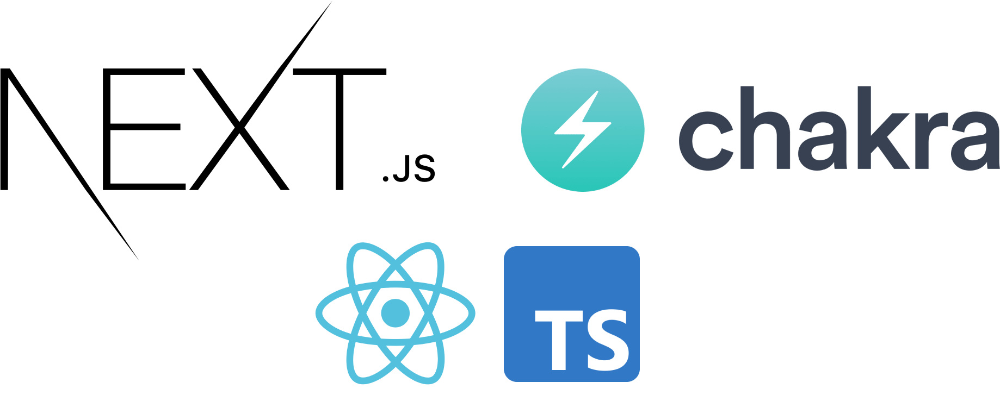

<br>
<div align="center">
    
  </h4>
</div>

---
## 🚀 Getting started

To clone and run the application, you will need to have [Git](https://git-scm.com), [Node.js](https://nodejs.org) + [Yarn](https://yarnpkg.com) installed on your machine. With all programs installed, run the following command lines:


```bash
# Clone this repository
$ git clone

# Access the repository
$ cd 

# Install the dependencies
$ npm or yarn install

# Run application
$ npm or yarn dev
```


